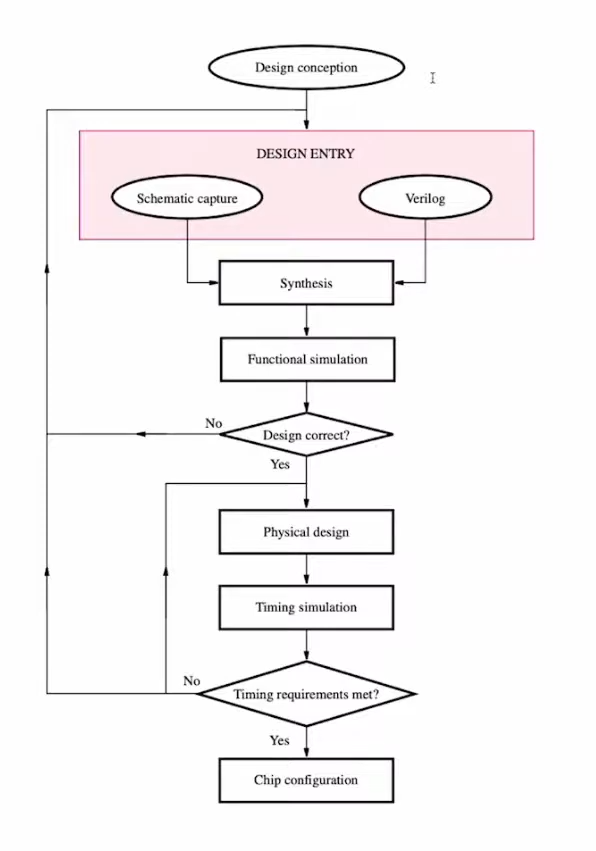

### CAD tools process flow chart

**Schematic capture** is the process of creating you digital circuit by connecting components together and wiring them similar to how designing circuits works in PCB design tools

**Verilog** is a HDL (hardware description language) that is used to define logical circuits in a textual manner similar to html defining the structure of webpages 

**Synthesis** is a tool in CAD software that takes your HDL code and compiles it into the actual logic circuit which is represented by a netlist by going through these steps
- **netlist generation**: after it error checks the code it generate the initial netlist
- **gate optimization**: then it performs gate optimization which reduces your logical circuit based on a given constraints 
- **technology mapping**: since Verilog isn’t specific to only FGPAs and could be used to program most PLDs or custom logic circuits the technology mapping step is the responsible for mapping your circuit to a certain technologies

**Simulation**: simulation is the process of verifying and testing the design which consists of either *functional simulation* that simulates and tests the Verilog code or post *synthesis simulation* that tests the output logic circuit of the synthesis process which is normally where most time spent in the design process which is known as *verification*

**physical design**: it’s the implementation step at which placement and routing are done where physical connections of logic cells and routes are specified 

**timing simulation**: it simulate the timing between your logic cells which correspond to the speed or frequency at which you can run your circuit, delays are normally introduced due to physical distances between logic cells

**chip configuration**: it generates a Bitstream which is a binary file of ones and zeros that specifies the configuration of the FPGA

### naming conventions
- 4 Logic Cells (LC) = Slice
-  2 Slices = Configurable Logic Block (CLB)
