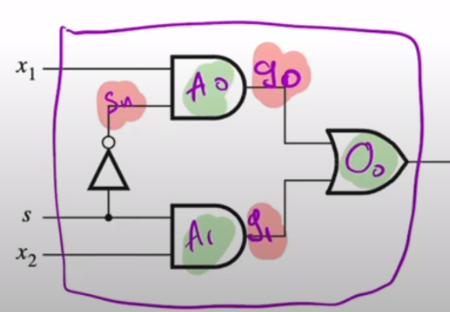
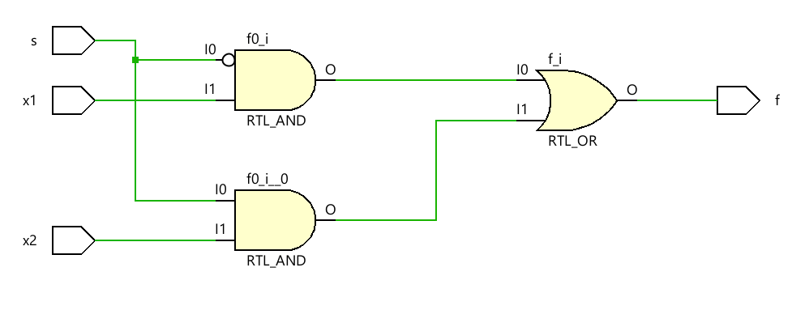

### Gate level modeling
Verilog Gate Primitives

| Name     | Description                               | Usage                |
| -------- | ----------------------------------------- | -------------------- |
| `and`    | $f = (a \cdot b \cdot \ldots)$            | `and(f, a, b, ...)`  |
| `nand`   | $f = \overline{(a \cdot b \cdot \ldots)}$ | `nand(f, a, b, ...)` |
| `or`     | $f = (a + b + \ldots)$                    | `or(f, a, b, ...)`   |
| `nor`    | $f = \overline{(a + b + \ldots)}$         | `nor(f, a, b, ...)`  |
| `xor`    | $f = (a \oplus b \oplus \ldots)$          | `xor(f, a, b, ...)`  |
| `xnor`   | $f = (a \odot b \odot \ldots)$            | `xnor(f, a, b, ...)` |
| `not`    | $f = \overline{a}$                        | `not(f, a)`          |
| `buf`    | $f = a$                                   | `buf(f, a)`          |
| `notif0` | $f = (!e \ ?\ \overline{a} : bz)$         | `notif0(f, a, e)`    |
| `notif1` | $f = (e \ ?\ \overline{a} : bz)$          | `notif1(f, a, e)`    |
| `bufif0` | $f = (!e \ ?\ a : bz)$                    | `bufif0(f, a, e)`    |
| `bufif1` | $f = (e \ ?\ a : bz)$                     | `bufif1(f, a, e)`    |
#### 2x1 mux using gate level modeling
```verilog
module mux_2x1_gate(
    input x1,x2,s,
    output f
    );
    
    wire sn, g0, g1;
    
    not (sn, s);
    and A1 (g1,x2,s);
    and A0 (g0,x1,sn);
    or O0(f, g0, g1);
endmodule
```

- the `wire` definition line isn’t necessary here since we are dealing with single bits but if we were dealing with busses it would be **mandatory** 
- in general you would want to define your wires since they make your code more **robust and clean**
- for most of the time the order of logic blocks definitions **doesn’t matter** cause you are describing your components not defining them (as in programming languages) 



### Dataflow modeling
in the data flow model you are descripting your circuit using a Boolean equation

#### Verilog operators and bit lengths

| Category             | Examples                                                                              | Bit Length                    |
| -------------------- | ------------------------------------------------------------------------------------- | ----------------------------- |
| $\text{Bitwise}$     | $\sim A,\ +A,\ -A$ <br> $A \& B,\ A \text{ \vert } B,\ A \oplus B,\ A\ \hat{}\sim\ B$ | $L(A)$ <br> $\max(L(A),L(B))$ |
| $\text{Logical}$     | $!A,\ A \&\& B,\ A \text{ \Vert } B$                                                  | $1\ \text{bit}$               |
| $\text{Reduction}$   | $\&A,\ \sim\&A,\ \text{\vert } A,\ \sim\text{\vert } A,\ \hat{}A,\ \sim\hat{}A$       | $1\ \text{bit}$               |
| $\text{Relational}$  | $A==B,\ A!=B,\ A>B,\ A<B$ <br> $A\geq B,\ A\leq B$ <br> $A===B,\ A!==B$               | $1\ \text{bit}$               |
| $\text{Arithmetic}$  | $A+B,\ A-B,\ A*B,\ A/B$ <br> $A\%B$                                                   | $\max(L(A),L(B))$             |
| $\text{Shift}$       | $A<<B,\ A>>B$                                                                         | $L(A)$                        |
| $\text{Concatenate}$ | $\{A,\dots,B\}$                                                                       | $L(A)+\dots+L(B)$             |
| $\text{Replication}$ | $\{B\{A\}\}$                                                                          | $B * L(A)$                    |
| $\text{Condition}$   | $A\ ?\ B : C$                                                                         | $\max(L(B),L(C))$             |

#### 2x1 mux using data flow modeling
```verilog
module mux_2x1_dataflow(
    input x1,x2,s,
    output f
    );
    
    assign f = ~s & x1 | s & x2;
endmodule
```
as you can see this time we used the `assign` keyword here since this is a continuous assignment which means that if there is any change on the right hand side of the equation the left side would change


> [!NOTE]
> **How does Verilog knows the order of logical operations**
> Verilog like mathematics follows operator precedence rules and operators form **highest to lowest** relevant are
> - `~` NOT
> - `&` AND
> - `|` OR

