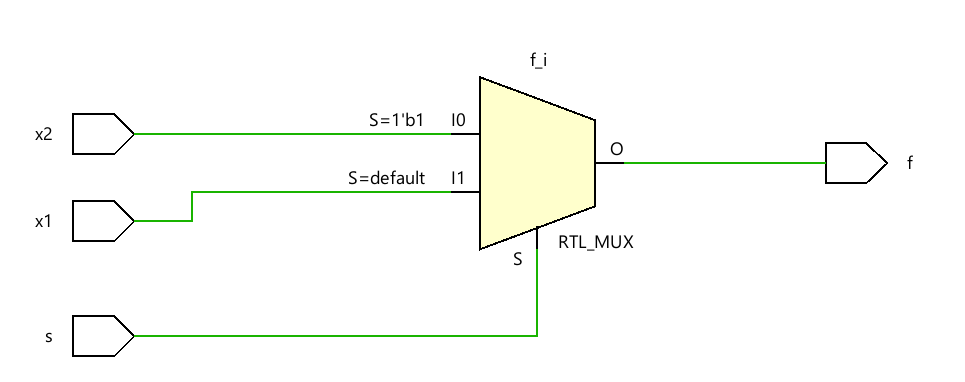

comments in Verilog follow the same pattern as in C so for a on line comment you can do // at the beginning of the line
```verilog
// this is a one line comment
```
and for a multi line comment you can do `/* `then write your comment and when you finish use `*/`
```verilog
/*
that is a multi line comment
you can add more than one line
*/
```
**a nice shortcut in most coding tools is that you can select the lines you want to comment and then press the shortcut `ctrl+/` to comment them**
### multiplexer code using the if statement


#### 2x1 mux using behavioral modeling
```verilog
module mux_2x1_beh(
    input x1,
    input x2,
    input s,
    output reg f
    );
    
    always @(x1,x2,s)
    begin
        if(s)
        begin
            f = x2;
        end
        else
        begin
            f = x1;
        end
    end
endmodule
```

 - in Verilog `begin` and `end` are equivalent to squiggly lines in C
- the `always` block is used to tell that a specific logic will be recalculated to provide the value of an input when triggered by the signals of a sensitivity list (similar to useEffect dependency array in React JS)
- when we use an assignment inside of an always block it’s called a procedural assignment which doesn’t need the assign keyword like the continuous assignment
- the output variables in the always blocks should be of type `reg` or register, this concept would be visited further in the course since registers aren’t generally needed in combinational circuits like a MUX circuit

### multiplexer code using the case statement
```verilog
module mux_2x1_beh(
    input x1,
    input x2,
    input s,
    output reg f
    );
    
    always @(x1,x2,s)
    begin
        case(s)
            1: f = x2;
            0: f = x1;
            default: f = x2; // not necessary here
        endcase
    end
endmodule
```

you can add a default block to the end of the case conditions in case if any condition haven’t been specified the default logic would take on and of course it’s not necessary in the above example

> [!WARNING]
> - avoid using loops unless it’s necessary since a loop with n iterations might get mapped to n elements
> - within the behavioral representation the order of statements might matter

