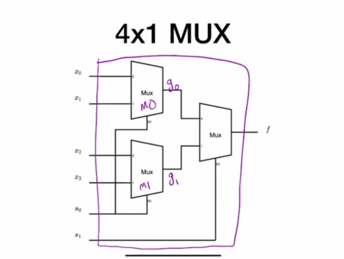

- **hierarchical design** is the process of building a logic circuit using smaller predefined circuits which is a common theme in logical circuitry
- to **instantiate** a logic circuit from other  modules you use the name of the circuit as a type and you give it a name which is **mandatory**
### how to build a 4x1 multiplexer from 2x1 multiplexers in verilog

```verilog
module mux_4x1(
    input x0, x1, x2, x3,
    input s0, s1,
    output f
    );
    
    wire g0, g1;
    
    mux_2x1_beh M3 ( // name port connection example
        .x1(g0),
        .x2(g1),
        .s(s1),
        .f(f)
    );
    
    // order port connection example
    mux_2x1_gate M0 (x0, x1, s0, g0);
    
    mux_2x1_dataflow M1 (
        .f(g1),
        .x1(x2),
        .s(s0),
        .x2(x3)
    );
    

    
endmodule
```
- **order port connection** is an instantiation method that relays on providing the input ports at the sequence at which they were defined and it’s considered a **terrible** practice since changing the module order or increasing the module ports have the potential to mess the module instance
- **name port connection** doesn’t care about the order at which the ports are provided since they work by mapping the module ports to the instance port using module port names which is considered the best and common practice for instantiation