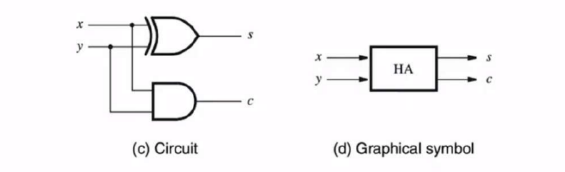
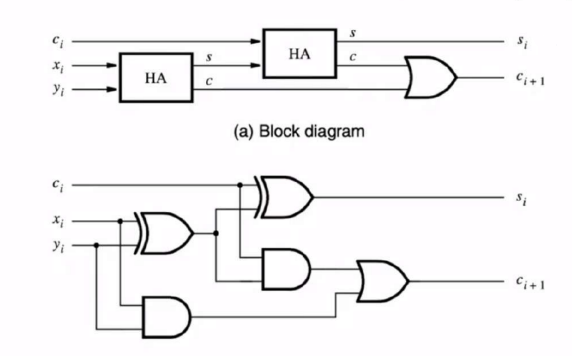
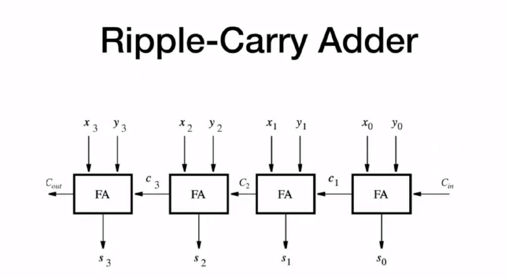

### how to design a ripple carry adder 
- if you want to design a ripple carry adder through hierarchical design through building first a **half adder** then using it to build a **full adder** and after that you can start cascading full adders to create the ripple carry adder
- though ripple carry adders have a disadvantage in their timing since in order to get out a useful signal you need to wait till your signal travels all the way throughout the cascaded system, an alternative solution could utilize the **look ahead adder**
---
### how to write a half adders in Verilog using the data flow model
```verilog
module half_adder(
    input x, y,
    output s, c
    );
    assign s = x ^ y; // the output is the xor of x and y
    assign c = x & y; // we have carry only when both x and y are one
endmodule
```


---
### how to write a full adder in Verilog based on a half adder
```verilog
module full_adder(
    input x, y, c_in,
    output s, c_out
    );
    
    wire s1,c1,c2;
    
    half_adder H0 (
        .x(x),
        .y(y),
        .s(s1),
        .c(c1)
    );
    
    half_adder H1 (
        .x(s1),
        .y(c_in),
        .s(s),
        .c(c2)
    );
    
    or(c_out,c1,c2);
    
    
endmodule
```


---
### how to write a 4 bit ripple carry adder
```verilog
module rca_4bit(
    input [3:0] x,y,
    input c_in,
    output [3:0] s,
    output c_out
    );
    
    wire c1,c2,c3;
    
    full_adder fa0(
        .x(x[0]),
        .y(y[0]),
        .c_in(c_in),
        .c_out(c1),
        .s(s[0])
    );
    
    full_adder fa1(
        .x(x[1]),
        .y(y[1]),
        .c_in(c1),
        .c_out(c2),
        .s(s[1])
    );
    
    full_adder fa2(
        .x(x[2]),
        .y(y[2]),
        .c_in(c2),
        .c_out(c3),
        .s(s[2])
    );
    
    full_adder fa3(
        .x(x[3]),
        .y(y[3]),
        .c_in(c3),
        .c_out(c_out),
        .s(s[3])
    );
endmodule
```


---

> [!NOTE]
> **significands order of buss bits**
> both of the codes below work the same in Verilog and won’t produce any sort of errors **but** it’s a convention to put the higher number as the most significant bit and the lower number as the least significand bit though the first code is better

```verilog
input [3:0] x; // => x3,x2,x1,x0
// in this code the most significand bit is x3 and the least is x0

input [0:3] x; // => x0,x1,x2,x3
// in this code the most significand bit is x0 and the least x3
```
