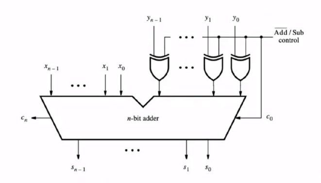

### how to design a subtractor
actually the design of subtractors is easy since it’s similar to the design and implementation of adders, because the what the subtractor is doing at the core is first computing the first complement of on of it’s arguments and then adding one to it, after that it can perform a normal addition revealing the answer to our subtraction
getting the first complement conditionally for the input y could be done through connecting it through an xor gate with an input parameter that once is one the signal would be inverted other wise it would remain the same, this way we can achieve the first complement and in order to achieve the second complement we can utilize the input carry and set it to one so that the circuit would add one to the result



now let’s write some code
### Verilog code for a four bit subtractor adder
before jumping straight to the generalized version let’s set things off with a four bit subtractor adder
```verilog
module adder_subtractor_4bit(
    input [3:0] x, y,
    input add_n,
    output [3:0] s,
    output c_out
    );
    
    // declare different signals
    wire [3:0] xored_y;
    
    // Instantiate 4 XOR gates    
    assign xored_y[0] = y[0] ^ add_n;
    assign xored_y[1] = y[1] ^ add_n;
    assign xored_y[2] = y[2] ^ add_n;
    assign xored_y[3] = y[3] ^ add_n;
    
    // Instantiate a 4-bit adder
    // using rca_nbit or rca_4bit
    rca_nbit #(.n(4)) r0(
        .x(x),
        .y(xored_y),
        .c_in(add_n),
        .s(s),
        .c_out(c_out)
    );
    
endmodule
```

now we can move forward to generalizing this code, actually most of this code would remain the same except that we would modify the module header to accept a new parameter and we would use the generate block to generate the xored bus

```verilog
module adder_subtractor_nbit
    #(parameter n = 4) (
    input [n - 1:0] x, y,
    input add_n,
    output [n - 1:0] s,
    output c_out
    );
    
    // declare different signals
    wire [n - 1: 0] xored_y;
    
    // generate several XOR gates
    generate
        genvar k;
        
        for (k = 0; k < n; k = k + 1)
        begin: bit
            assign xored_y[k] = y[k] ^ add_n;
        end
    endgenerate
    
    // Instantiate an n-bit adder
    rca_nbit #(.n(n)) adder0 (
        .x(x),
        .y(xored_y),
        .c_in(add_n),
        .s(s),
        .c_out(c_out)
    );
    
endmodule
```