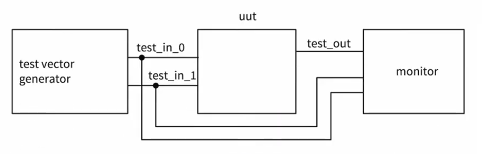

so the way test benches work is by generating a set of text vectors or inputs and feeding them into our unit under test or uut (basically the module you want to test) and see the inputs and outputs of it on a monitor



### test benches writing steps
1) Declare local reg and wire identifiers
2) Instantiate the module under test
3) Specify a stopwatch to stop the simulation
4) Generate stimuli, using initial and always
5) Display the output response (text or graphics (or both) )

so first we go to sources window in Vivado and add a simulation source and give it a meaningful name and then let’s go through our steps one by one
#### Declare local reg and wire identifiers
reg and wires are two data types in Verilog, **reg** is something that stores a value and since we would generate test vectors and we would like to store them some where we would use the type **reg**, and **wire** is generally the stuff that you are gonna take a look at so they would be the output
so generally speaking we use **reg** for **inputs** and **wire** for **outputs**
so declaring regs and wires would look like that

```verilog
    // 1) Declare local reg and wire identifiers
    parameter n = 4;
    reg signed [n - 1: 0]  x, y;
    reg add_n;
    wire signed [n - 1:0] s;
    wire c_out;
    wire overflow;
```

#### Instantiate the module under test
here we do a simple instantiation that looks like what we used to do in hierarchical design
```verilog
// 2) Instantiate the module under test
    adder_subtractor #(.n(n)) uut (
        .x(x),
        .y(y),
        .add_n(add_n),
        .s(s),
        .c_out(c_out),
        .overflow(overflow)
    );
```

#### Specify a stopwatch to stop the simulation
actually this step is kind of optional since simulation time is specified in the project options but you can specify something that stops it before that if you wanted to using the `initial` which is similar to an always statement but it only runs once 

```verilog
// 3) Specify a stopwatch to stop the simulation
initial
begin
	#40 $finish;
end
```

#### Generate stimuli, using initial and always
now we will start generating different inputs for the inputs and since this is behavioral you need to do it either in **always statement** or in **initial statement**
the difference is that initial will only run once which in combinational circuits will be enough while in sequential circuits it might be necessary to use the always statement
after you define an input you can use the `#` to define a new time stamp, note that if you didn’t do that the input will apply you input and then change to the next state before appearing on the simulation
so now the inputs for our adder_subtractor might look something like this
```verilog
// 4) Generate stimuli, using initial and always
// Basically the test vector generator
initial
begin
	// add 2 numbers
	add_n = 1'b0;
	x = 4'd5;
	y = 4'd6;
	
	// subtract numbers
	#10
	add_n = 1'b1;
	
	#10
	x = 4'd6;
	y = -4'd3;
	
	#10
	add_n = 1'b0;
	x = -4'd4;
	y = -4'd5;
	``
	#10;
	
end
```
#### Display the output response (text or graphics (or both) )
now after we generated stimuli we can see the simulation by pressing the `run behavioral simulation` button 
this will show you the graphical representation of the simulation similar to what you might see on a logic analyzer but you can use the textual method which would display your test output to a console like test scripts in programming languages 
the textual method makes use of the monitor system function which is kind of similar to the `printf` in C 
so if we wanted to log our values to the console the code would look like that
```verilog
// 5) Display the output response (text or graphics (or both))
initial
begin
	$monitor("time = %3d: x = %d \t y = %d \t add_n = %1b \t result = %3d \t cout = %1b \t overflow = %1b",
			 $time, x, y, add_n, s, c_out, overflow);
end
```
you would notice that the input for the monitor is very similar to the `printf` inputs and we can see that we are utilizing the `\t` which is a known escape sequence in coding that is used to print a horizontal taps to align columns in multiline console logs

>[!NOTE] 
>**system functions in Verilog**
>whenever you see a dollar sign and a keyword this is probably a Verilog system function like for example `$finish`, `$monitor`, and `$time` which are a built-in subroutines used for simulation control, debugging, and file management so we will find that `$finish` is used to terminate the simulation while  `$monitor` is used to log something to the monitor and `$time` returns the current time stamp

#### final benchmark code
and our final test code for the adder_subtractor would look like this
```verilog
`timescale 1ns / 1ps // <= notice that this line profide the scale for
                     // the timing code that comes after the #
//////////////////////////////////////////////////////////////////////////////////

module adder_subtractor_tb(

    );
    
    // 1) Declare local reg and wire identifiers
    parameter n = 4;
    reg signed [n - 1: 0]  x, y;
    reg add_n;
    wire signed [n - 1:0] s;
    wire c_out;
    wire overflow;
    
    // 2) Instantiate the module under test
    adder_subtractor #(.n(n)) uut (
        .x(x),
        .y(y),
        .add_n(add_n),
        .s(s),
        .c_out(c_out),
        .overflow(overflow)
    );
    
    // 3) Specify a stopwatch to stop the simulation
    initial
        #40 $finish;
        
    // 4) Generate stimuli, using initial and always
    // Basically the test vector generator
    initial
    begin
        // add 2 numbers
        add_n = 1'b0;
        x = 4'd5;
        y = 4'd6;
        
        // subtract numbers
        #10
        add_n = 1'b1;
        
        #10
        x = 4'd6;
        y = -4'd3;
        
        #10
        add_n = 1'b0;
        x = -4'd4;
        y = -4'd5;
        
        #10;
        
    end
    
    
    // 5) Display the output response (text or graphics (or both))
    initial
    begin
        $monitor("time = %3d: x = %d \t y = %d \t add_n = %1b \t result = %3d \t cout = %1b \t overflow = %1b",
                 $time, x, y, add_n, s, c_out, overflow);
    end
endmodule
```