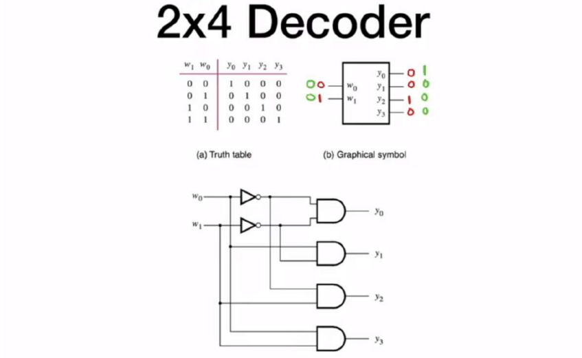
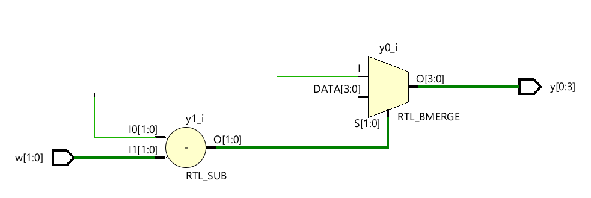
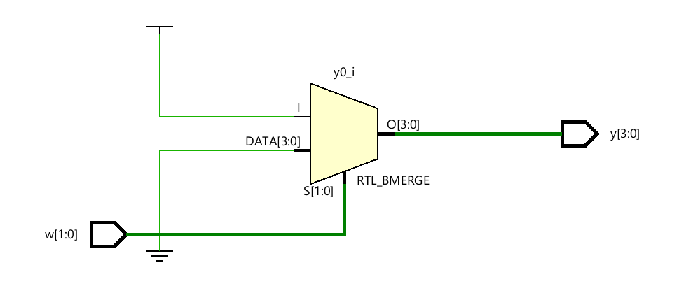
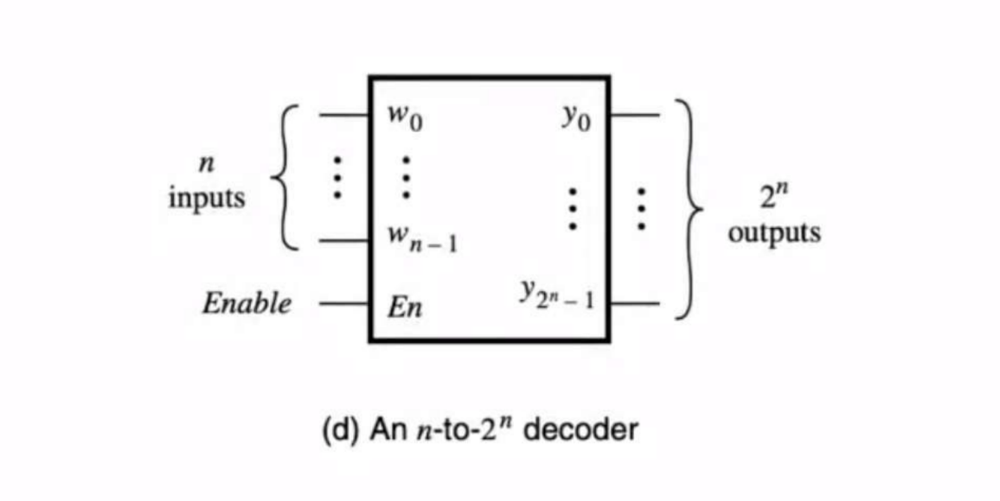

a decoder is a building block block of combinational circuits that has $n$ number of inputs and $2^n$ number of outputs, then it turns the output pin selected by the inputs high and the rest of the pins are low


decoders are important cause you can use them to select circuits and activate or deactivate them, another application of decoders is giving you the minterms of the inputs

now let’s write it in verilog
### 2x4 behavioral decoder
```verilog
module decoder_2x4(
    input [1:0] w,
    output reg [0:3] y
    );
    
    always @(w)
    begin
        //default case
        y = 4'b0000;
        
        if(w == 2'b00)
            y[0] = 1'b1;
        else if(w == 2'b01)
            y[1] = 1'b1;
        else if(w == 2'b10)
            y[3] = 1'b1;
        else if(w == 2'b11)
            y[3] = 1'b1;
        else 
            // since we covered all if branches this line is redundant
            // but it's a good practice to write
            y = 4'b0000;
    end
endmodule

```

that code works but it uses priority routing network, we could achieve a better circuit using multiplexing routing network by coding our logic using a parallel case statement

```verilog
module decoder_2x4(
    input [1:0] w,
    output reg [0:3] y
    );
    always @(w)
    begin
        //default case
        y = 4'b0000;
        case(w)
        2'b00 : y[0] = 1;
        2'b01 : y[1] = 1;
        2'b10 : y[2] = 1;
        2'b11 : y[3] = 1;
        default: y = 4'b0000;
        // since we covered all case branches this line is redundant
        // but it's a good practice to write
        endcase  
    end
endmodule
```

actually there is an easier way to write this circuit based on our understanding of the decoder, basically what the decoder is doing is that it takes the pin with the number described by the input pins and sets it high, so our code could use this logic
```verilog
module decoder_2x4(
    input [1:0] w,
    output reg [0:3] y
    );
    always @(w)
    begin
        //default case
        y = 4'b0000;
        y[w] = 1'b1;  
    end
endmodule

```

when we look at the generated schematic for that circuit we will find it like this

but hold on, what is that subtractor at the beginning, the reason for that subtractor is that our input indexes goes in ascending order from 0 to 1, while our output goes in descending order from 11 to 0  so in order to map inputs correctly to their designated outputs it subtracts the input from 11 to inverse the order, so if we reversed the order of the output bus indexes we get rid of that subtractor, which by the way wasn’t an issue at the beginning

```verilog
module decoder_2x4(
    input [1:0] w,
    output reg [3:0] y
    );
    always @(w)
    begin
        //default case
        y = 4'b0000;
        y[w] = 1'b1;  
    end
endmodule
```

### Enable pins
most circuits do have enable pins which decide whether we are using it or not, so if we added an enable pin to the decoder once it’s off it would set all the output pins low, here how can we add an enable pin

```verilog
module decoder_2x4_en(
    input [1:0] w,
    input en,
    output reg [0:3] y
    );
    always @(w,en)
    begin
        //default case
        y = 4'b0000;
        
        case(en)
        0: y[w] = 1'b0;  
        1: y[w] = 1'b1; 
        endcase 
    end
endmodule
```

### generic decoder


now lets create a generic decoder that takes $n$ number of inputs and has $2^n$ number of outputs

```verilog
module decoder_generic
    #(parameter n = 8)(
    input [1:0] w,
    input en,
    output reg [0: 2**n-1] y
    );
    always @(w,en)
    begin
        //default case
        y = 'b0;
        
        case(en)
        0: y[w] = 'b0;  
        1: y[w] = 1'b1; 
        endcase 
    end
endmodule
```

> [!NOTE]
>note that parameters aren’t included in the circuit and they are computed before the synthesis process similar to the macros expansion in the preprocessing step in c code compilation

