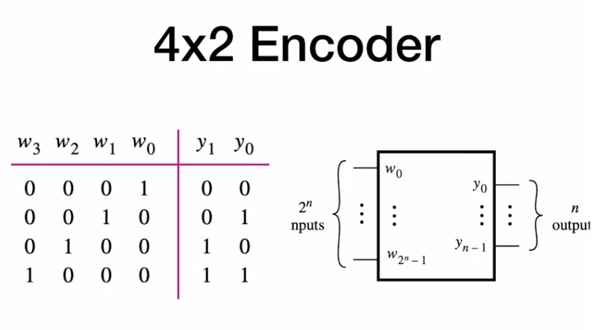
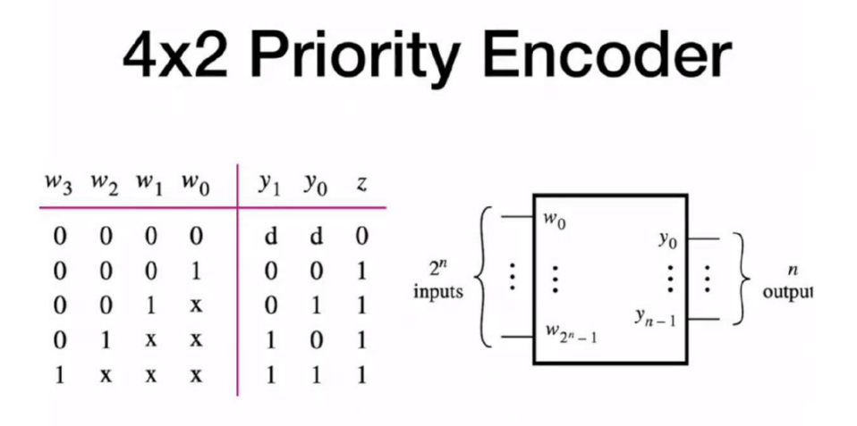

a generic encoder have $2^n$ input pins and $n$ output pins, the way it works is that all of the inputs are low except one which based on it’s number the outputs are set which is useful to reduce the number of bits, which might be useful for transition


### 4x2 Encoder
```verilog
module encoder_4x2(
    input [3:0] w,
    output reg [1:0] y
    );
    
    always @(w)
    begin
    y = 2'bxx;
        case(w)
            4'b0001: y = 0;
            4'b0010: y = 1;
            4'b0100: y = 2;
            4'b1000: y = 3;
            default: y = 2'bxx;
        endcase
    end

endmodule
```
as you can see this code uses the case statement but we can also implement it using the if statement
```verilog
module encoder_4x2(
    input [3:0] w,
    output reg [1:0] y
    );
    always @(w)
    begin
	    y = 2'bxx;
	        if(w == 1)
	            y = 0;
	        else if (w == 2)
	            y = 1;
	        else if (w == 4)
	            y = 2;
	        else if (w == 8)
	            y = 3;
	        else 
	            y = 2'bxx;
    end

endmodule
```

### 4x2 priority encoder
but as you can see this code doesn’t account for all input values, so we can use a priority encoder with that, which works by giving the index of the highest priority active pin , the output z is used if none of the outputs is active




```verilog
module priority_encoder_4x2(
    input [3:0] w,
    output reg [1:0] y,
    output z
    );
    
    // reduction OR
    assign z = |w;
    always @(w)
        begin
        y = 2'bxx;
            if(w[3])
                y = 2'b11;
            else if (w[2])
                y = 2'b10;
            else if (w[1])
                y = 2'b01;
            else if (w[0])
                y = 2'b00;
            else 
                y = 2'bxx;
        end
endmodule
```
- as you can see we here used the reduction operator `|w` to take the OR of all w bits, there are more reduction operators which are very useful
  
though a priority encoder is a text book example for a situation that is suitable to a priority routing network we can represent it using a case statement
```verilog
module priority_encoder_4x2(
    input [3:0] w,
    output reg [1:0] y,
    output z
    );
assign z = |w;
    
    always @(w)
    begin
        y = 2'bxx;
        casex(w)
            4'b1xxx : y = 2'b11;
            4'b01xx : y = 2'b10;
            4'b001x : y = 2'b01;
            4'b0001 : y = 2'b00;
            default : y = 2'bxx;
        endcase
    end
endmodule

```
 - as you case see we used here `casex` instead of `case` the reason is that in `case` verilog would treat the `x` in our numbers as a true unknown not as 0 or 1, so if you want the latter use `casex

### generic priority encoder 
```verilog
module priority_encoder_generic
    #(parameter n = 4) (
        input [n-1 : 0] w,
        output reg [$clog2(n)-1 : 0] y,
        input z
    );
    
    assign z = |w;
    
    integer k;
    always @(w)
    begin
		y = 'bx;
        for (k = 0; k < n ; k = k+1)
	        if(w[k])
	            y = k;
    end
endmodule
```
 - if you find that code confusing basically what we are doing here is that we are going to each pin after the other starting form the smallest index pin, we ask whether it’s asserted or not, if it was we put it’s index on the output, if not we do nothing, then we move to the next pin, if it’s asserted we don’t care what happened before and set the index on the output erasing any low priority inputs, if it’s not we don’t change it, and so on with each pin