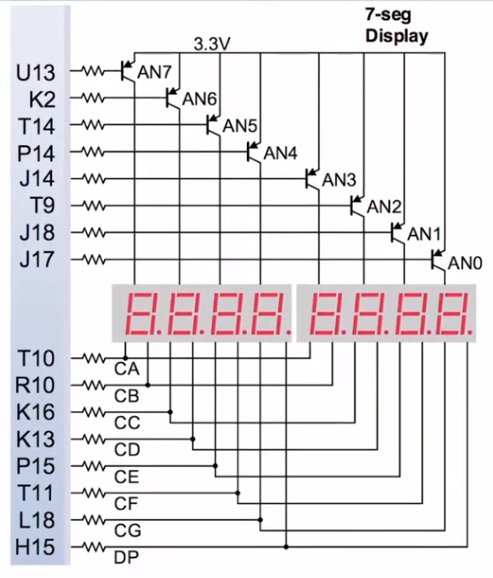

the nexys board has a total of eight sevens segments display each one of them having 8 segments including the decimal point, so to connect all of them you directly you would need a total of 64 i/o pin which is a lot of pins, so what the nexys board does is that it multiplexes them, so you have eight bits for each segments and eight bits to select the segments that are one needing a total of 16 i/o


### seven segments code convertor
```verilog
module hex2sseg(
    input [3:0] hex,
    output reg [6:0] sseg
    );
    
    always @(hex)
    begin
        sseg = 7'bxxxxxxx;
        case(hex) //gfedcba
            0: sseg = 7'b1000000;
            1: sseg = 7'b1111001;            
            2: sseg = 7'b0100100;             
            3: sseg = 7'b0110000;              
            4: sseg = 7'b0011001;             
            5: sseg = 7'b0010010;             
            6: sseg = 7'b0000010;             
            7: sseg = 7'b1111000;             
            8: sseg = 7'b0000000;             
            9: sseg = 7'b0010000;             
            10: sseg = 7'b0001000;             
            11: sseg = 7'b0000011;             
            12: sseg = 7'b1000110;             
            13: sseg = 7'b0100001;             
            14: sseg = 7'b0000110;             
            15: sseg = 7'b0001110;             
        endcase
    end
```

### seven segments wrapper
now we need a module that would take our code converter and make it easier to work with it and implement it on the nexys board, what it has to do is to have an input for the hex value, input to choose the displays, another for the decimal point
```verilog
module sseg_test(
    input [3:0] hex,
    input [7:0] sw,
    input DP_input,
    output DP_output,
    output [7:0] AN,
    output [6:0] sseg
    );
    
    // decimal point
    assign DP_output = DP_input;
    
    // displays switches
    assign AN = sw;
    
    // code converter
    hex2sseg BO(
    .hex(hex),
    .sseg(sseg)
    );
    
endmodule
```