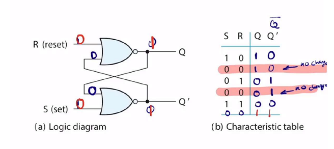
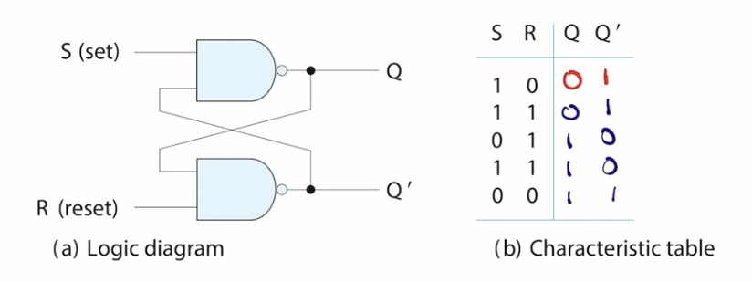
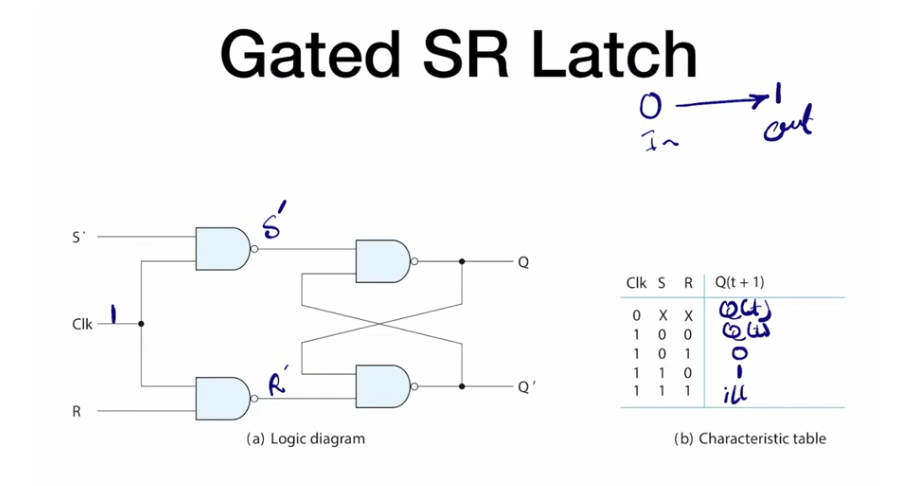
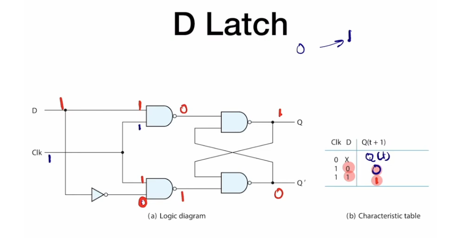
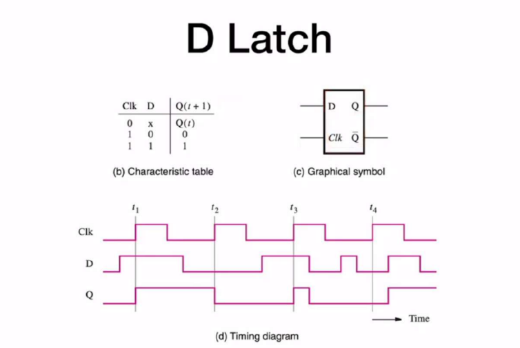
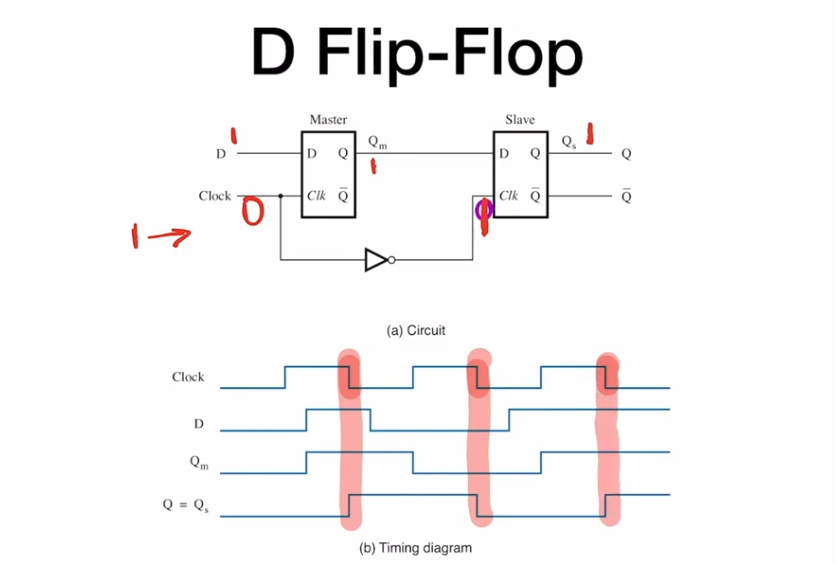

we create an SR latch using what we call a cross coupled NOR gate which creates a storage element because the output doesn’t only depend on the inputs but also the previous state of inputs, they are characterized by what we call a characteristics table which is different from truth table cause it’s not combinational circuit anymore

- note that `11`  is called illegible condition because it causes an unwanted condition which is the output being `00`, the reason that we don’t want `00` is because we always assume that `Q` and `Q'` are opposite of each other, also the logic gates have minor tolerances so one might switch faster than the other causing an unpredictable behavior

you can also create the same circuit with NAND gates but it will change what you consider the set and reset

the reason we care about the gates is that once we change the input signal we can’t have any control on the output signal and so we might use what is known as a gated SR latch to add an enable signal in the form of clock

that is already a huge step in the right direction but a problem with this design is the illegal condition, if you don’t want it you shouldn’t include it in your characteristics table at the first place, another latch that addresses this issue is the D latch which gives the user only one input which sets or resets the output

- we call the D latch the invisible latch because whatever is on the input appears on the output as long as the CLK is on, which is called lever sensitive devices because of it’s dependence on the CLK

### D latch summery

so as you can see from the timing diagram of the D latch the output can change multiple times during the high duration of the clock which might be undesirable in a lot of applications so we construct what is known as a flip-flop, which works similar to latches but the difference it that they are edge triggered instead of being level triggered and they output the input value only at the falling edge, there are multiple ways to construct D flip-flops but the simplest is this
