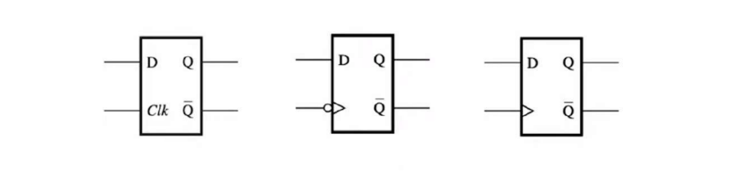

in this module we well see how can we describe D latches and D flip-flops in verilog, note that we can use data flow modeling or gate flow modeling through hierarchical design to construct our circuit, but we will use behavioral modeling since it’s the  most used to describe sequential circuits



### D-latch using behavioral modeling
```verilog
module D_latch(
    input D, clk,
    output reg Q,
    output Q_b
    );
    
    assign Q_b = ~Q;
    
    always @(D, clk)
    begin 
        Q = Q;
        if(clk)
            Q = D;
        else 
            Q = Q;
    end
endmodule
```

### D flip-flop using behavioral modeling
this is a negative edge triggered d flip flop
```verilog
module D_FF_neg(
    input D, clk,
    output reg Q,
    output Q_b
    );
    
    assign Q_b = ~Q;
    
    always @(negedge clk)
    begin 
        Q = D;
    end
endmodule
```
notice the use of `negedge` to specify that it’s negative edge triggered

we can use a similar approach to write a circuit that is activated with the positive edge of the clock
```verilog
module D_FF_pos(
    input D, clk,
    output reg Q,
    output Q_b
    );
    
    assign Q_b = ~Q;
    
    always @(posedge clk)
    begin 
        Q = D;
    end
endmodule

```

### testing our circuit
let’s create a component to contain the output of our three circuits to test them simultaneously
```verilog
module compare_storage_elements(
    input D,
    input clk,
    output Q_latch, Q_neg, Q_pos,
    output Q_b_latch, Q_b_neg, Q_b_pos
    );
    
    // D latch
    D_latch latch (
    .D(D),
    .clk(clk),
    .Q(Q_latch),
    .Q_b(Q_b_latch)
    );
    
    // negative edge D flip flop
    D_FF_neg n_flip_flop (
    .D(D),
    .clk(clk),
    .Q(Q_neg),
    .Q_b(Q_b_neg)
    );
    
    // positive edge D flip flop
    D_FF_pos p_flip_flop (
    .D(D),
    .clk(clk),
    .Q(Q_pos),
    .Q_b(Q_b_pos)
    );
        
endmodule
```

now let’s start with the test, but first we have to define our clock in the stimuli section
```verilog
localparam T = 20;
always
begin
	clk = 1'b0;
	#(T / 2)
	clk = 1'b1;
	#(T / 2)
end
```
- notice the use of `localparam` which is a parameter that is local inside the module which doesn’t get defined or overridden during instantiation, you might think of it like a local scope variable in programming languages’ functions
now let’s introduce some timing control structures
```verilog
#20                          // wait for 20 time units
#(2*T)                       // wait for 2T time units (T is localparam)
@ (negedge rest);            // wait reset to deassert
@ (negedge clx);             // wait to the next negative clk edge
repeat(10) @(negedge clk);   // wait for 10 negative clk edges
wait (x == 2);               // wait for x to become 2
wait (y);                    // wait for y to become 1
$stop                        // stop simulation
```

now let’s write  the test bench
```verilog
module compare_storage_elements_tb(

    );
    // Declare local reg and wire
    reg clk, D;
    wire Q_latch, Q_ff_pos, Q_ff_neg;
    wire Q_b_latch, Q_b_ff_pos, Q_b_ff_neg;
    
    // Instantiate unit under test
    compare_storage_elements uut(
        .D(D),
        .clk(clk),
        .Q_latch(Q_latch),
        .Q_pos(Q_ff_pos),
        .Q_neg(Q_ff_neg),
        .Q_b_latch(Q_b_latch),
        .Q_b_pos(Q_b_ff_pos),
        .Q_b_neg(Q_b_ff_neg)
    );
    
    // Generate stimuli, using initial and always
    
    // Generating a clk signal
    // Clock period is T nano seconds
    localparam T = 20; //local parameter, is a parameter not visible outside the module
    always
    begin
        clk = 1'b0;
        #(T / 2);
        clk = 1'b1;
        #(T / 2);
    end
    
    // Generating different D value at different times
    initial
    begin
        D = 1'b1;
        
        # (2 * T); //wait for 2T time units 
        D = 1'b0;
        
        @(posedge clk);
        D = 1'b1;
        
        #2 D = 1'b0;       
        #3 D = 1'b1;
        #4 D = 1'b0;
        
        repeat(2) @(negedge clk);
        D = 1'b1;
        
        #20 $stop;
    end
endmodule

```