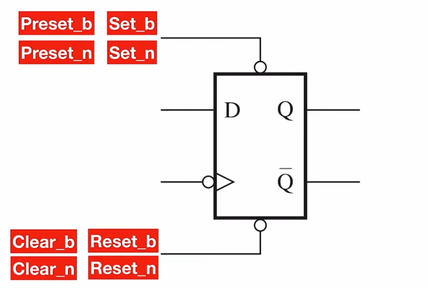

in this module we will discuss how can we set and reset the values of certain registers synchronously and asynchronously


the pin down is an active low reset pin and the pin up is an active low set pin, these pins once activated set or reset the flip flop, the names written at each pin is the names you might encounter used to describe this pin

>[!NOTE]
> **naming conventions**
> note that naming of the reset pins and set pins, when we say that a pin is active low we but `_` in the name like the pins above since all of them are active low, when we want them active high we just type the name directly like `Resetb` or `setn`


### asynchronous flip flop with reset
```verilog
module D_FF_reset(
    input D, clk,
    input reset_n,
    output Q
    );
    
    reg Q_reg, Q_next;
    
    // Asynchronous reset
    always @(negedge clk, negedge reset_n)
    begin
        if(!reset_n)
            Q_reg <= 1'b0;
        else
            Q_reg <= Q_next;
    end
    
    // next state logic
    always @(D)
    begin
        Q_next = D;
    end

    // output logic
    assign Q = Q_reg;
endmodule
```

in this code the reset effect is produced only with the negative edge of the reset pin while working independent of the clock and that is what is meant by asynchronous

we defined the use of the reset pin in the asynchronous side of the logic because we don’t want it to be blocked the combinational implementation or the clock, so if we had defined it in the combinational part this would reset only at the negative edge of the clock

### synchronous flip flop with reset
```verilog
module D_FF_clear(
    input D, clk,
    input clear_n,
    output Q
    );
    
    reg Q_next, Q_reg;
    
    always @(negedge clk)
    begin
        Q_reg <= Q_next;
    end
    
    // synchronous clear
    always @(D, clear_n)
    begin
        Q_next = clear_n ? D : 1'b0;
    end
    
    // output logic 
    assign Q = Q_reg;
endmodule

```

here we called the pin clear just to differentiate between the synchronous and he asynchronous code

as you can see in this implementation we defined the clear in the combinational section of the code because we care about the clock

>[!NOTE]
>note here that we have used the conditional operator instead of the if statement like used in the video lecture, the reason for that is that in the video lecture we defined both asynchronous reset and synchronous reset in these same block, so when the synthesize tool compiled our code it produced a flip flop with both of the synchronous and asynchronous resets, but in the code above when I implemented these resets in separate files (one module with the asynchronous and a separate one with the synchronous) I found that both of them (including the synchronous one) get’s rendered to an asynchronous reset, and after some researching I found out that the tool behaves like that due to something called template matching, and that this issue doesn’t appear in some other synthesizes tools, in short by using the conditional operator we describe the actual gate structure (since it’s a data flow modeling), I understand that this leaves questions asked more than the answered but I spent a lot of time investigating this, more than what I am willing to admit, without reaching to something useful, however I encourage you to try implementing the flip flop in separate files like I did and try to investigate this weird issue, and I hope that you reach far beyond what I did.

### flip flop with set
now let’s add the synchronous set to our first implementation implementation
```verilog
module D_FF_set_reset(
    input clk,
    input D,
    input reset_n,
    input set_n,
    output Q
    );
    
    reg Q_reg, Q_next;
    
    // Asynchronous reset
    always @(negedge clk, negedge reset_n) 
    begin
        if (!reset_n)
            Q_reg <= 1'b0;
        else
            Q_reg <= Q_next;
    end
    

    // Synchronous set    
    // Next state logic
    always @(D, set_n)
    begin
        Q_next = Q_reg;
        if(!set_n)
            Q_next = 1'b1;
        else
            Q_next = D;
    end
    
    
    //-----------------------------------------------

    // Output logic
    assign Q = Q_reg;
endmodule
```

