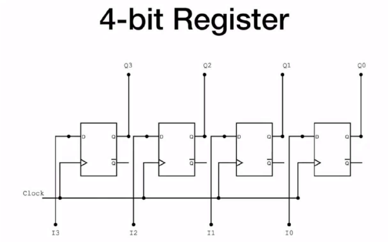
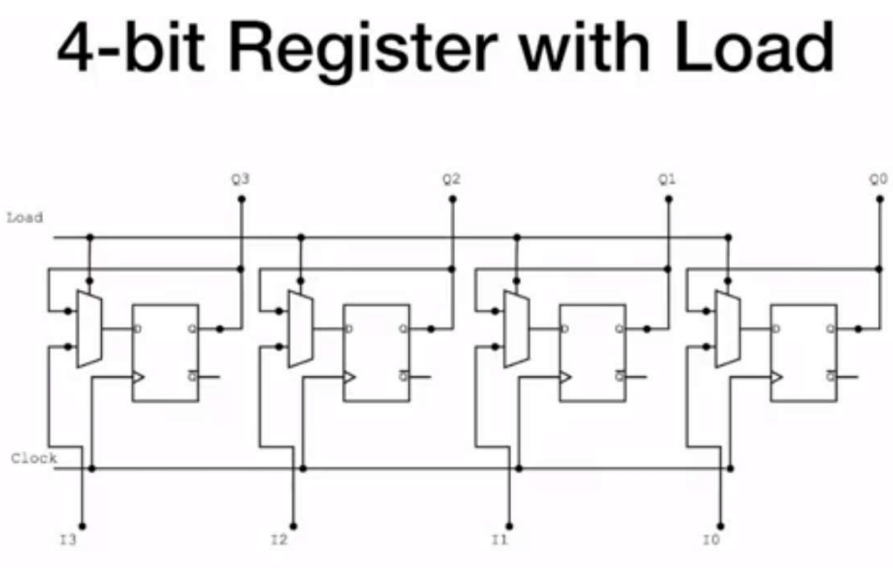
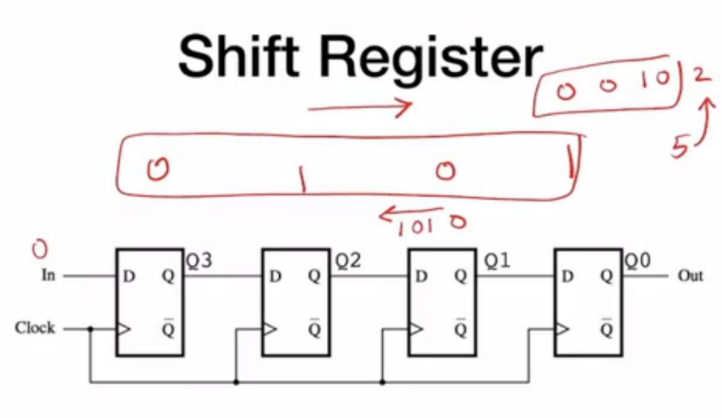
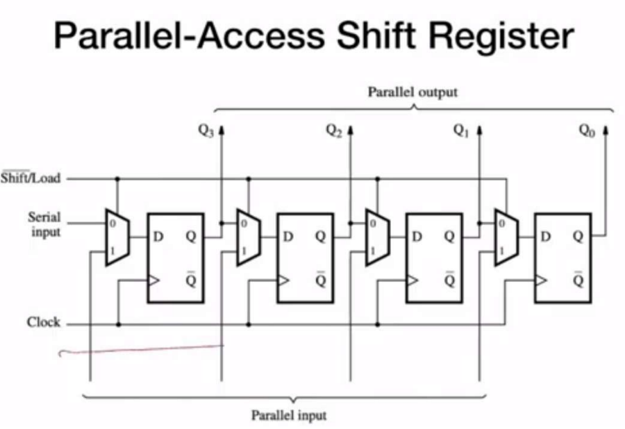
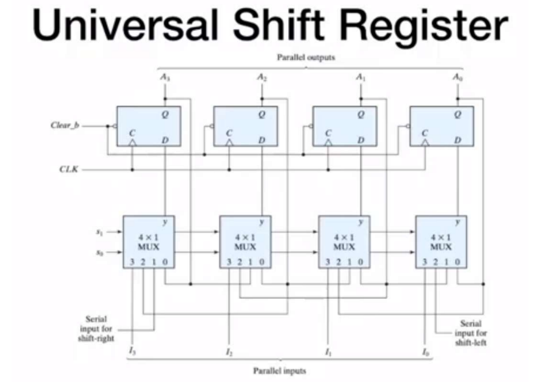
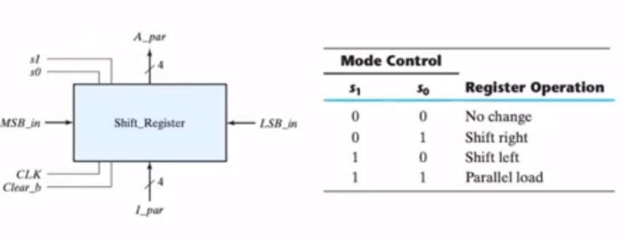

register is just a term that describes a bunch of flip flops, they can store data and perform simple operations like shifting left or shifting right, they are used in FSMs or as ports in communication protocols

in this module we will go through the different ways you can design a register

### n bit register


```verilog
module simple_register
    #(parameter n = 4)(
    input [n-1:0] I,
    input clk,
    output [n-1:0] Q 
    );
	
	// Structurall description    
    genvar k;
    
    generate
        for(k=0; k<n; k = k+1)
        begin: FF
            D_FF_reset(
            .clk(clk),
            .D(I[k]),
            .reset_n(),
            .Q(Q[k])
            );
        end
    endgenerate
endmodule
```

as you can see this code is structural code but you might prefer writing it behaviorally like the following code

```verilog
module simple_register
    #(parameter n = 4)(
    input [n-1:0] I,
    input clk,
    output [n-1:0] Q 
    );
    
	// Behavioral description
    reg [n-1: 0] Q_reg, Q_next;
    
    always @(posedge clk)
    begin
        Q_reg <= Q_next;
    end
    
    always @(I)
    begin
        Q_next = I;
    end
    
    assign Q = Q_reg;
    
endmodule
```

### n bit register with load


our previous register had a huge flowback which is that it don’t hold on it’s data, it is always sampling D so we might want to control this process and add a load input that only once activated D get’s sampled
```verilog
module simple_register_load
    #(parameter n = 4)(
    input [n-1:0] I,
    input clk,
    input load,
    output [n-1:0] Q 
    );

    reg [n-1: 0] Q_reg, Q_next;

    always @(posedge clk)
    begin
        Q_reg <= Q_next;
    end
    
    always @(I)
    begin
        if(load)
            Q_next = I;
        else
            Q_next = Q_reg;
    end
    
    assign Q = Q_reg;

endmodule
``` 

### shift registers

shift registers offer the functionality of shifting the bits to the right or left which is a useful operation in logic design since shifting to the right is equivalent to dividing by two and shifting to left is equivalent to  multiplying with two, and they are also used in communication protocols to cut down the number of wires 

```verilog
module shift_register
    #(parameter n = 4)(
    input SI,
    output SO,
    input clk
    );
    
    // Behavioral description
    reg [n-1: 0] Q_reg, Q_next;

    always @(posedge clk)
    begin
        Q_reg <= Q_next;
    end
    
    always @(SI,Q_reg)
    begin
        // shift right
        Q_next = {SI, Q_reg[n-1 : 1]};
    end
    
    // shift output for shift right
    assign SO = Q_reg[0];

endmodule
```

note how we used the concatenation syntax here which is similar to array concatenation in high level languages like JavaScript

### parallel Access shift register


as you can see the previous shift register is always shifting so let’s add more control to it and make it either can load values or shift them

```verilog
module shift_register_load
    #(parameter n = 4)(
    input clk,
    input SI,
    input load,
    input reset_n,
    input [n-1:0]I,
    output [n-1:0]Q,
    output SO
    );
    
    // Behavioral description
    reg [n-1: 0] Q_reg, Q_next;

    always @(posedge clk, negedge reset_n)
    begin
        if(!reset_n)
            Q_reg <= 1'b0;
        else
            Q_reg <= Q_next;
    end
    
    always @(SI,Q_reg,load)
    begin
        if(load)
            Q_next = I;
        else
            Q_next = {SI, Q_reg[n-1:1]};
    end
    
    // shift output for shift right
    assign SO = Q_reg[0];
    assign Q = Q_reg;

endmodule
```

### universal shift register

no let’s complete our register and make it only shift or load once asked to

```verilog
module univ_shift_reg
    #(parameter n = 4)(
    input clk, reset_n,
    input MSB_in, LSB_in,
    input [n-1: 0] I,
    input [1:0] s,
    output [n-1: 0] Q
    );
    
    // Behavioral description
    reg [n-1: 0] Q_reg, Q_next;

    always @(posedge clk, negedge reset_n)
    begin
        if(!reset_n)
            Q_reg <= 1'b0;
        else
            Q_reg <= Q_next;
    end
    
    always @(Q_reg, MSB_in, LSB_in, Q_reg, I, s)
    begin
        Q_next = Q_reg;
        case (s)
            2'b00: Q_next = Q_reg; // No change
            2'b01: Q_next = {MSB_in, Q_reg[n - 1:1]}; // Shift right
            2'b10: Q_next = {Q_reg[n - 2:0], LSB_in}; // Shift left
            2'b11: Q_next = I; // Parallel load
            default: Q_next = Q_reg; 
        endcase    
    end
    
    // output logic
    assign Q = Q_reg;

endmodule
```

if you got confused this table illustrates the shift register controls


>[!NOTE]
>so in general the way to work with registers and flip flops in verilog is as follow:
> - define local registers inside the module for the current state and the next and the current state (`Q_reg` and `Q_next`)
> - use sequential logic and non blocking assignment to link between them and add any asynchronous features you want like asynchronous set and asynchronous reset
> - use combinational logic for the input stage before the flip flop
> - use combinational logic for the output stage after the flip flop

