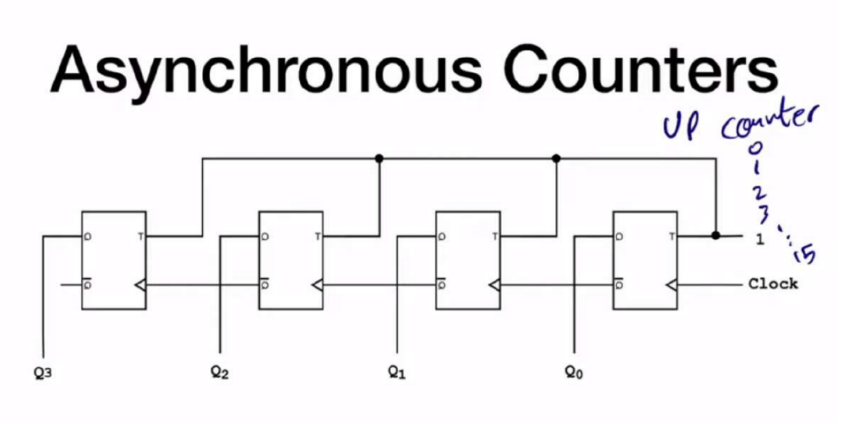
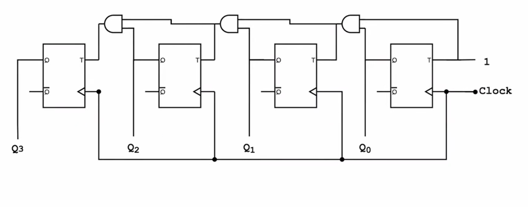

Asynchronous counters are built of T flip flops and they are called asynchronous cause the clock of each flip flop is the $\bar{Q}$ of the flip flop before it so the clock signal isn’t the same between them, which is what Asynchronous mean

### T flip flop
as you might have noticed the building block for our counter is the t flip flop so let’s first write the code for it

```verilog
module T_FF(
    input clk,
    input T,
    input reset_n,
    input Q
    );
    
    reg Q_next, Q_reg;
    
    localparam C2Q_delay = 2;
    
    always @(posedge clk, negedge reset_n)
    begin
        if(!reset_n)
            Q_reg <= 1'b0;
        else
            #C2Q_delay Q_reg <= Q_next;
    end
    
    // next state logic
    always @(T, Q_reg)
    begin
        if(T)
            Q_next = ~Q_reg;
        else
            Q_next = Q_reg;
    end
    
    // output logic
    assign Q = Q_reg;
endmodule
```

notice the use of `localparam C20_delay = 2;` and this code for the FPGA  is meaningless but it’s used only for simulation purposes, the goal of it is to add a delay between the clock and the update of the flip flop output value

### asynchronous up counter
now let’s use structural modeling to construct a 4 bit counter using t flip flops

```verilog
module asynch_up_counter(
    input clk,
    input reset_n,
    output [3:0] Q
    );
    
    T_FF T0 (
    .clk(clk),
    .T(1),
    .reset_n(reset_n),
    .Q(Q[0])
    );
    
    T_FF T1 (
    .clk(~Q[0]),
    .T(1),
    .reset_n(reset_n),
    .Q(Q[1])
    );
    
    T_FF T2 (
    .clk(~Q[1]),
    .T(1),
    .reset_n(reset_n),
    .Q(Q[2])
    );
    
   T_FF T3 (
    .clk(~Q[2]),
    .T(1),
    .reset_n(reset_n),
    .Q(Q[3])
    );
endmodule
```

now let’s create a test bench to test this module
```verilog
module asynch_up_counter_tb(
    ); 

//1) Declare local reg and wire identifiers

reg clk, reset_n;
wire [3:0] Q;

//2) Instantiate the module under test
asynch_up_counter uut (
    .clk(clk),
    .reset_n(reset_n),
    .Q(Q)
    );
    
//3) Specify a stopwatch to stop the simulation
initial
begin 
    #200 $stop;
end

//4) Generate stimuli, using initial and always
// clock cycle
localparam T = 10;
always
begin
    clk = 1'b0;
    #(T / 2); //<= you have to put T/2 inside parentheses
              // in order for the math expression to be evaluated first 
    clk = 1'b1;
    #(T / 2);
end

initial
begin
    reset_n = 1'b0;
    #2 reset_n = 1'b1;
end

endmodule

```

as you can see the code for the test bench here is really easy, during the stimuli we used the always block to create a clock that runs forever then we used the initial to start our flip flop at zero

>[!WARNING]
>the test bench would reveal one of the flaws of the asynchronous counter which is that the clock signal takes time to propagate between flip flops creating a delay, which causes some flip flops to update before others creating a gap where the counter output isn’t right, this gap is normally small but when you are working with fast clock rates systems it might be problematic

for that reason we might use synchronous counter to solve this issue.

----
### synchronous up counters

like the previous counter let’s code it using structural modeling
```verilog
module synch_up_counter(
    input clk,
    input reset_n,
    output [3:0] Q
    );
    
    wire [3:0] Q_next;
    
    assign Q_next[0] = 1'b1;
    T_FF T0 (
    .clk(clk),
    .T(Q_next[0]),
    .reset_n(reset_n),
    .Q(Q[0])
    );
    
    assign Q_next[1] = Q_next[0] & Q[0];
    T_FF T1 (
    .clk(clk),
    .T(Q_next[1]),
    .reset_n(reset_n),
    .Q(Q[1])
    );
    
    assign Q_next[2] = Q_next[1] & Q[1];
    T_FF T2 (
    .clk(clk),
    .T(Q_next[2]),
    .reset_n(reset_n),
    .Q(Q[2])
    );
    
    assign Q_next[3] = Q_next[2] & Q[2];
    T_FF T3 (
    .clk(clk),
    .T(Q_next[3]),
    .reset_n(reset_n),
    .Q(Q[3])
    );
endmodule
```

once we run the same previous testbench on this code we find that it don’t suffer from the glitches issue, which is the main advantage of the synchronous counters

note that though the delays are extremely reduced in the synchronous counters compared to the asynchronous ones, it’s still present since the enable signal still needs to propagate through the AND gates (critical path)

the advantage of asynchronous counters is that they are simple to build compared to the synchronous ones making them perfect for low frequency circuits