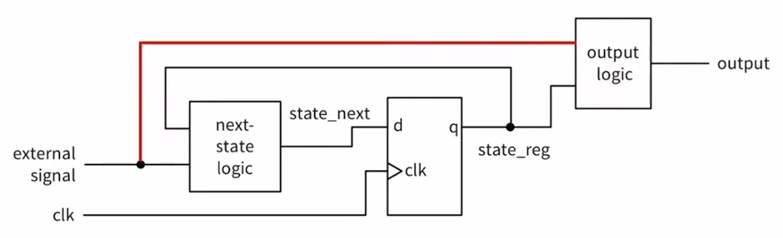

 
 in this module we will discuss a generalized method to describe synchronous counters in verilog and this method of course follows the general synchronous guidelines we discussed before

### general up counters
here is how can we create a behaviorally modeled generalized up counter

```verilog
module up_counter
    #(parameter BTS = 4)(
    input clk,
    input reset_n,
    output [BTS-1: 0] Q
    );
    
    reg [BTS - 1: 0] Q_next, Q_reg;
    
    always @(posedge clk, negedge reset_n)
    begin
        if(!reset_n)
            Q_reg <= 1'b0;
        else
            Q_reg <= Q_next;
    end
    
    // next state logic
    always @(Q_reg)
    begin
        Q_next = Q_reg + 1;
    end
    
    // output logic
    assign Q = Q_reg;
 
endmodule
```

the combinational part in counters is straight forward as you can see which is just describing the next number relative to the current one

### general up down counter
you a simple modification in the combinational part of our logic we can turn this counter into a down counter so we can add a pin to choose whether it’s counting up or down, also we will add enable pin to stop or resume the counting

```verilog
module up_down_counter
    #(parameter BTS = 4)(
    input clk,
    input reset_n,
    input enable,
    input up,
    output [BTS-1: 0] Q
    );
    
    reg [BTS - 1: 0] Q_next, Q_reg;
    
    always @(posedge clk, negedge reset_n)
    begin
        if(!reset_n)
            Q_reg <= 1'b0;
        else if (enable)
            Q_reg <= Q_next;
        else
            Q_reg <= Q_reg;
    end
    
    // next state logic
    always @(Q_reg, up)
    begin
        if(up)
            Q_next = Q_reg + 1;
        else
            Q_next = Q_reg - 1;
    end
    
    // output logic
    assign Q = Q_reg;
 
endmodule
```

now let’s modify our test bench to suit this new counter, in order to do so we will need some of the system functions we learned in describing D latches and D_FF module
```verilog
#20                          // wait for 20 time units
#(2*T)                       // wait for 2T time units (T is localparam)
@ (negedge rest);            // wait reset to deassert
@ (negedge clx);             // wait to the next negative clk edge
repeat(10) @(negedge clk);   // wait for 10 negative clk edges
wait (x == 2);               // wait for x to become 2
wait (y);                    // wait for y to become 1
$stop                        // stop simulation
```

for the testbench we want to turn on the reset, wait two clock cycles then turn on the enable and let it count for some time till it reaches 15 before we turn it off, wait two clock cycles, and then set it as a down counter, if it sound confusing that’s cuz it is 😅, but I am sure that it will be clear with the code

```verilog
module up_down_counter_tb(
    );
    //1) Declare local reg and wire identifiers
    reg clk, reset_n, enable, up;
    wire [3:0] Q;
    
    //2) Instantiate the module under test
    up_down_counter uut (
        .clk(clk),
        .reset_n(reset_n),
        .enable(enable),
        .up(up),
        .Q(Q)
        );
        
    //3) Specify a stopwatch to stop the simulation
    initial
    begin 
        #300 $stop;
    end
    
    //4) Generate stimuli, using initial and always
    // clock cycle
    localparam T = 10;
    always
    begin
        clk = 1'b0;
        #(T / 2); //<= you have to put T/2 inside parentheses
                  // in order for the math expression to be evaluated first 
        clk = 1'b1;
        #(T / 2);
    end
    
    initial
    begin
        reset_n = 1'b0;
        enable = 1'b0;
        up = 1'b1;
        #2 reset_n = 1'b1;
        
        repeat(2) @(negedge clk);
            enable = 1'b1;
        
        wait(Q == 15);
            enable = 1'b0;
        
        repeat(2) @(negedge clk);
            up = 1'b0;
            enable = 1'b1;

    end
    
endmodule
```

### UDL counters
UDL stand for up down and load counter, so we can set a specific starting point for the counter to go up or down from

```verilog
module udl_counter
    #(parameter BITS = 4)(
    input clk,
    input reset_n,
    input enable,
    input up, //when asserted the counter is up counter; otherwise, it is a down counter
    input load,
    input [BITS - 1:0] D,
    output [BITS - 1:0] Q
    );
    
    reg [BITS - 1:0] Q_reg, Q_next;
    
    always @(posedge clk, negedge reset_n)
    begin
        if (~reset_n)
            Q_reg <= 'b0;
        else if(enable)
            Q_reg <= Q_next;
        else
            Q_reg <= Q_reg;
    end
    
    // Next state logic
    always @(*)
    begin
        Q_next = Q_reg;
        casex({load,up})
            2'b00: Q_next = Q_reg - 1;
            2'b01: Q_next = Q_reg + 1;
            2'b1x: Q_next = D;
            default: Q_next = Q_reg;
        endcase
        
    end
    
    // Output logic
    assign Q = Q_reg;
endmodule
```

notice how instead of defining the load case two times when the up is low or high we used `2'b1x` to denote that we don’t care about the up value, also in order to interpret it as a physical don’t care instead of just matching it with an x we need to use `casex`

also notice the use of `always @(*)` which means that the tool will figure out automatically the  sensitivity list