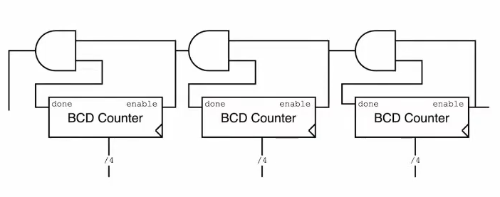

BCD counters are just modulus counters that count up to ten and sometimes they are referred to as decade counters


### BCD counter
you might recognize this code as a hardcoded modulus counter with a modulus of ten but there is extra important thing here which is that we are exposing the done signal to the output done, the reason is that this way we can cascade them and count multiple digits
```verilog
module BCD_counter (
    input clk,
    input reset_n,
    input enable,
    output done,
    output [3:0] Q
    );
    
    reg [3:0] Q_reg, Q_next;
    
    always @(posedge clk, negedge reset_n)
    begin
        if (~reset_n)
            Q_reg <= 'b0;
        else if(enable)
            Q_reg <= Q_next;
        else
            Q_reg <= Q_reg;
    end
    
    // Next state logic
    // Hard coded final value
    assign done = Q_reg == 9;

    always @(*)
        Q_next = done? 'b0: Q_reg + 1;
    
    // Output logic
    assign Q = Q_reg;
endmodule
```

### multi decade counter
as you can see we just cascaded our BCD counter to create a counter that counts multiple digits

```verilog
module multi_decade_counter(
    input clk,
    input enable,
    input reset_n,
    input done,
    output [3:0] ones, tens, hundreds
    );
    
    wire done0, done1, done2;
    wire enable0, enable1, enable2;
    
    assign enable0 = enable;
    BCD_counter BCD0 (
        .clk(clk),
        .reset_n(reset_n),
        .enable(enable0),
        .done(done0),
        .Q(ones)
    );
    
    assign enable1 = done0 & enable0;
    BCD_counter BCD1 (
        .clk(clk),
        .reset_n(reset_n),
        .enable(enable1),
        .done(done1),
        .Q(tens)
    );
    
    assign enable2 = done1 & enable1;
    BCD_counter BCD2 (
        .clk(clk),
        .reset_n(reset_n),
        .enable(enable2),
        .done(done2),
        .Q(hundreds)
    );
    
    assign done = done2 & enable2;
endmodule
```

